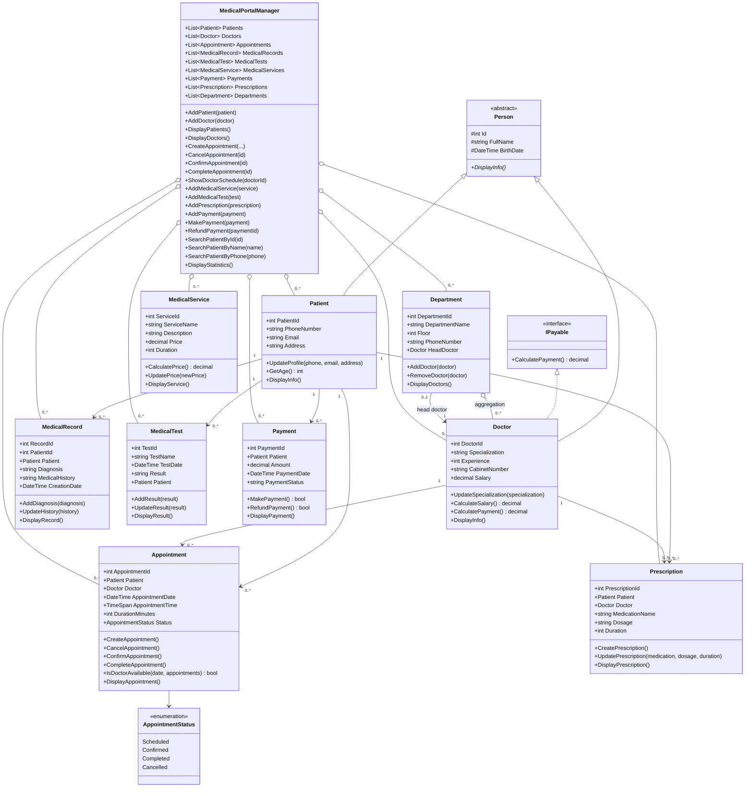

# Medical Portal - UML class diagram

```mermaid
classDiagram
    class Person {
        <<abstract>>
        #int Id
        #string FullName
        #DateTime BirthDate
        +DisplayInfo()*
    }
    class Patient {
        +int PatientId
        +string PhoneNumber
        +string Email
        +string Address
        +UpdateProfile(phone, email, address)
        +GetAge() int
        +DisplayInfo()
    }
    class Doctor {
        +int DoctorId
        +string Specialization
        +int Experience
        +string CabinetNumber
        +decimal Salary
        +UpdateSpecialization(specialization)
        +CalculateSalary() decimal
        +CalculatePayment() decimal
        +DisplayInfo()
    }
    class IPayable {
        <<interface>>
        +CalculatePayment() decimal
    }
    class Department {
        +int DepartmentId
        +string DepartmentName
        +int Floor
        +string PhoneNumber
        +Doctor HeadDoctor
        +AddDoctor(doctor)
        +RemoveDoctor(doctor)
        +DisplayDoctors()
    }
    class Appointment {
        +int AppointmentId
        +Patient Patient
        +Doctor Doctor
        +DateTime AppointmentDate
        +TimeSpan AppointmentTime
        +int DurationMinutes
        +AppointmentStatus Status
        +CreateAppointment()
        +CancelAppointment()
        +ConfirmAppointment()
        +CompleteAppointment()
        +IsDoctorAvailable(date, appointments) bool
        +DisplayAppointment()
    }
    class AppointmentStatus {
        <<enumeration>>
        Scheduled
        Confirmed
        Completed
        Cancelled
    }
    class MedicalRecord {
        +int RecordId
        +int PatientId
        +Patient Patient
        +string Diagnosis
        +string MedicalHistory
        +DateTime CreationDate
        +AddDiagnosis(diagnosis)
        +UpdateHistory(history)
        +DisplayRecord()
    }
    class MedicalTest {
        +int TestId
        +string TestName
        +DateTime TestDate
        +string Result
        +Patient Patient
        +AddResult(result)
        +UpdateResult(result)
        +DisplayResult()
    }
    class MedicalService {
        +int ServiceId
        +string ServiceName
        +string Description
        +decimal Price
        +int Duration
        +CalculatePrice() decimal
        +UpdatePrice(newPrice)
        +DisplayService()
    }
    class Payment {
        +int PaymentId
        +Patient Patient
        +decimal Amount
        +DateTime PaymentDate
        +string PaymentStatus
        +MakePayment() bool
        +RefundPayment() bool
        +DisplayPayment()
    }
    class Prescription {
        +int PrescriptionId
        +Patient Patient
        +Doctor Doctor
        +string MedicationName
        +string Dosage
        +int Duration
        +CreatePrescription()
        +UpdatePrescription(medication, dosage, duration)
        +DisplayPrescription()
    }
    class MedicalPortalManager {
        +List~Patient~ Patients
        +List~Doctor~ Doctors
        +List~Appointment~ Appointments
        +List~MedicalRecord~ MedicalRecords
        +List~MedicalTest~ MedicalTests
        +List~MedicalService~ MedicalServices
        +List~Payment~ Payments
        +List~Prescription~ Prescriptions
        +List~Department~ Departments
        +AddPatient(patient)
        +AddDoctor(doctor)
        +DisplayPatients()
        +DisplayDoctors()
        +CreateAppointment(...)
        +CancelAppointment(id)
        +ConfirmAppointment(id)
        +CompleteAppointment(id)
        +ShowDoctorSchedule(doctorId)
        +AddMedicalService(service)
        +AddMedicalTest(test)
        +AddPrescription(prescription)
        +AddPayment(payment)
        +MakePayment(payment)
        +RefundPayment(paymentId)
        +SearchPatientById(id)
        +SearchPatientByName(name)
        +SearchPatientByPhone(phone)
        +DisplayStatistics()
    }

    Person <|-- Patient
    Person <|-- Doctor
    IPayable <|.. Doctor
    Department o-- "0..*" Doctor : aggregation
    Department "0..1" --> "1" Doctor : head doctor
    Patient "1" --> "0..*" Appointment
    Doctor "1" --> "0..*" Appointment
    Appointment --> AppointmentStatus
    Patient "1" --> "0..*" MedicalRecord : patient reference
    Patient "1" --> "0..*" MedicalTest
    Patient "1" --> "0..*" Payment
    Patient "1" --> "0..*" Prescription
    Doctor "1" --> "0..*" Prescription
    MedicalPortalManager o-- "0..*" Patient
    MedicalPortalManager o-- "0..*" Doctor
    MedicalPortalManager o-- "0..*" Appointment
    MedicalPortalManager o-- "0..*" MedicalRecord
    MedicalPortalManager o-- "0..*" MedicalTest
    MedicalPortalManager o-- "0..*" MedicalService
    MedicalPortalManager o-- "0..*" Payment
    MedicalPortalManager o-- "0..*" Prescription
    MedicalPortalManager o-- "0..*" Department
```
